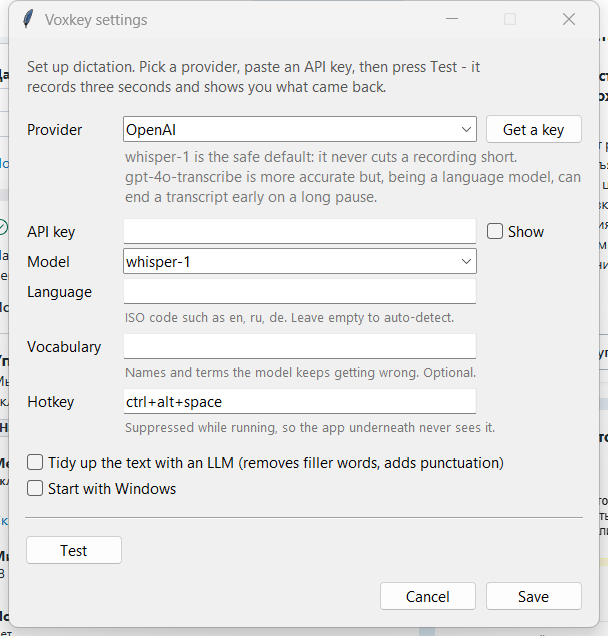

<div align="center">

# Voxkey

**Hold a hotkey, speak, and the text appears in whatever you were typing in.**

Anywhere in Windows — browser, chat, code editor, spreadsheet, address bar.

[](https://github.com/Heigen007/Voxkey/actions/workflows/ci.yml)
[](LICENSE)


<br>


</div>

```
Ctrl+Alt+Space   start recording
Enter            stop — text lands at your cursor
Esc              cancel
```

<!-- TODO: a demo GIF belongs here, showing dictation into a real input: docs/demo.gif -->

---

## Why another dictation tool

Most open-source dictation apps run the model on your machine. That is great
for privacy and terrible for a cheap laptop: a multi-gigabyte download, a slow
first run, and mediocre accuracy on anything that is not English.

Voxkey goes the other way. It is a **30 MB executable with no model to
download**, it starts instantly on any machine, and because it talks to hosted
models it is genuinely good in languages that small local models mangle —
Russian, Kazakh, Ukrainian, Polish, Turkish.

You bring your own API key, so there is no subscription and no middleman.
**With Groq's free tier it costs nothing at all.**

If you want fully offline dictation, use one of the excellent local-first
projects instead — that is a real trade-off, not a missing feature.

## Quick start

1. **Get the app.** Download `Voxkey.exe` from
   [Releases](https://github.com/Heigen007/Voxkey/releases), or
   [build it yourself](#building-from-source) — the binary is built by CI from
   the tagged source, never uploaded by hand.
2. **Run it.** Windows will warn you about an unsigned app; see
   [SmartScreen](#smartscreen-and-antivirus). A microphone icon appears in the
   system tray.
3. **Set it up.** Click the tray icon → **Settings**. Pick a provider, paste an
   API key, press **Test** — it records three seconds and shows you exactly what
   came back. Tick **Start with Windows** and you are done.

<p align="center">
  
</p>

That is it. No terminal, no config file to edit, no Python.

### Setting it up with an AI assistant

If you use Claude Code, Cursor, or a similar agent, paste this and let it do
the work:

```text
Set up Voxkey (https://github.com/Heigen007/Voxkey), a Windows voice dictation
tool, on this machine.

1. Clone the repository into a folder that will not move afterwards.
2. Create a virtual environment and install it with: pip install -e ".[dev]"
3. Run the test suite to confirm the environment is sane.
4. Build the executable: powershell -ExecutionPolicy Bypass -File build.ps1
5. Launch dist\Voxkey.exe and confirm it is running.

Do not ask me for an API key and do not write one into any file. I will paste
it into the app's own settings window myself. Once it is running, tell me to
open Settings from the microphone icon in the system tray.
```

The last paragraph matters: **your API key should never pass through an AI
assistant's context.** The app has a settings window precisely so it does not
have to.

## Providers

Any service that implements the OpenAI audio API works.

| Provider | Default model | Notes |
|---|---|---|
| **Groq** | `whisper-large-v3-turbo` | Has a free tier. Fast, cheap, and the reason this tool can cost you nothing. |
| **OpenAI** | `whisper-1` | Also `gpt-4o-transcribe` — more accurate, but see the warning below. |
| **Custom** | yours | Any OpenAI-compatible endpoint: a self-hosted Whisper server, a proxy, another vendor. Works with no API key at all. |

> **On `gpt-4o-transcribe`:** it is a language model, not a classic
> transcriber, and it can decide a recording has ended at a long pause —
> silently returning only the first sentence. `whisper-1` and Groq's Whisper
> cannot do that, which is why they are the defaults.

## How it works

Two details make the difference between a tool you use daily and one you
uninstall:

**The recording bar never takes focus.** It is created with
`WS_EX_NOACTIVATE`, so your cursor stays exactly where it was. If something
does steal focus while you are talking — a notification, an alt-tab — Voxkey
refuses to paste blindly into the wrong window. The text goes to your
clipboard and the bar tells you to press Ctrl+V. Dictating into the wrong chat
window is worse than one extra keystroke.

**Enter and Esc are only swallowed while recording.** Enter has to stop the
recording without reaching the app — otherwise it submits your still-empty
message a second before the transcript lands in it. Outside a recording both
keys behave completely normally.

The hotkey itself is always suppressed, so it never reaches the app
underneath.

## Configuration

Everything is in the settings window. If you prefer a file, it lives at
`%APPDATA%\Voxkey\config.json`.

| Setting | Default | |
|---|---|---|
| Provider / model | Groq or OpenAI | Where the audio goes. |
| Hotkey | `ctrl+alt+space` | Suppressed while the app runs. |
| Language | auto | ISO code (`en`, `ru`, `de`). Setting it improves accuracy. |
| Vocabulary | empty | Names and terms the model keeps getting wrong. |
| Tidy up the text | off | An extra LLM pass that removes filler words and fixes punctuation. Adds a second or two. |
| Start with Windows | off | A shortcut in your Startup folder. No registry, no admin. |

**Your API key is encrypted with Windows DPAPI**, tied to your user account —
it is not sitting in plain text in a JSON file that a backup or a sync client
might pick up.

Two environment variables help when developing: `VOXKEY_CONFIG_DIR` moves the
config, `VOXKEY_API_KEY` supplies a key without writing it to disk.

## Building from source

```powershell
git clone https://github.com/Heigen007/Voxkey
cd voxkey
py -3 -m venv .venv
.venv\Scripts\python.exe -m pip install -e ".[dev]"
powershell -ExecutionPolicy Bypass -File build.ps1
```

`build.ps1` runs the tests first and refuses to package a broken build. The
result is `dist\Voxkey.exe`.

To run without packaging: `.venv\Scripts\pythonw.exe -m voxkey`

## SmartScreen and antivirus

Let us be direct about this, because the behaviour looks alarming and you
should understand it before running anything.

**Voxkey installs a global keyboard hook, records your microphone, and sends
audio over the network.** That is also, precisely, the profile of spyware. An
antivirus cannot tell the difference from behaviour alone, and PyInstaller
executables are a common false-positive source.

What you can actually do about it:

- **Read the source.** It is about 1,700 lines of Python across 16 files. The
  entire network surface is one of them:
  [`transcriber.py`](src/voxkey/transcriber.py), 100 lines. It talks to the
  endpoint you configured and nowhere else.
- **Verify the binary came from that source.** Releases are built by GitHub
  Actions and signed with a build attestation:
  ```
  gh attestation verify Voxkey.exe --repo Heigen007/Voxkey
  ```
- **Or build it yourself** with the commands above and trust nothing.

The binary is **not code-signed** — a certificate costs a few hundred dollars a
year, and this is a free project. So SmartScreen will show "Windows protected
your PC" on first run: **More info** → **Run anyway**.

## Privacy

- Audio goes to the provider you configured, and to nobody else.
- Recordings are never written to disk. They exist in memory until the
  response arrives.
- **No telemetry, no analytics, no update check, no phoning home.**
- Logging is off by default and creates no file. Turn it on only to diagnose
  something; it then records timings and the last 60 characters of a
  transcript, never the whole thing.

## Known limitations

- **Windows only.** The focus handling, the keyboard hook and DPAPI are all
  Win32. A cross-platform port would be a rewrite of three modules.
- **Elevated windows.** The hotkey will not fire inside apps running as
  administrator unless Voxkey is elevated too. That is Windows isolation
  working as designed.
- **The clipboard is borrowed.** Voxkey puts the transcript there, pastes, and
  restores what was there before. Non-text clipboard content — an image — does
  not survive the round trip.
- **Quit from the tray, not Task Manager.** A one-file PyInstaller build
  unpacks itself into `%TEMP%` and cleans up on a normal exit. Killing the
  process leaves ~65 MB behind each time.
- **Silence produces phantom text.** Whisper models hallucinate on near-silent
  audio — hit the hotkey by accident, say nothing, and you may get a stray
  sentence in a random language. Press `Esc` instead of `Enter` if you did not
  mean to record.

## Contributing

Issues and pull requests are welcome — see [CONTRIBUTING.md](CONTRIBUTING.md).
Translations are especially easy: every user-visible string lives in
[`strings.py`](src/voxkey/strings.py).

## License

MIT — see [LICENSE](LICENSE). Third-party licenses are listed in
[THIRD-PARTY-NOTICES.md](THIRD-PARTY-NOTICES.md).
